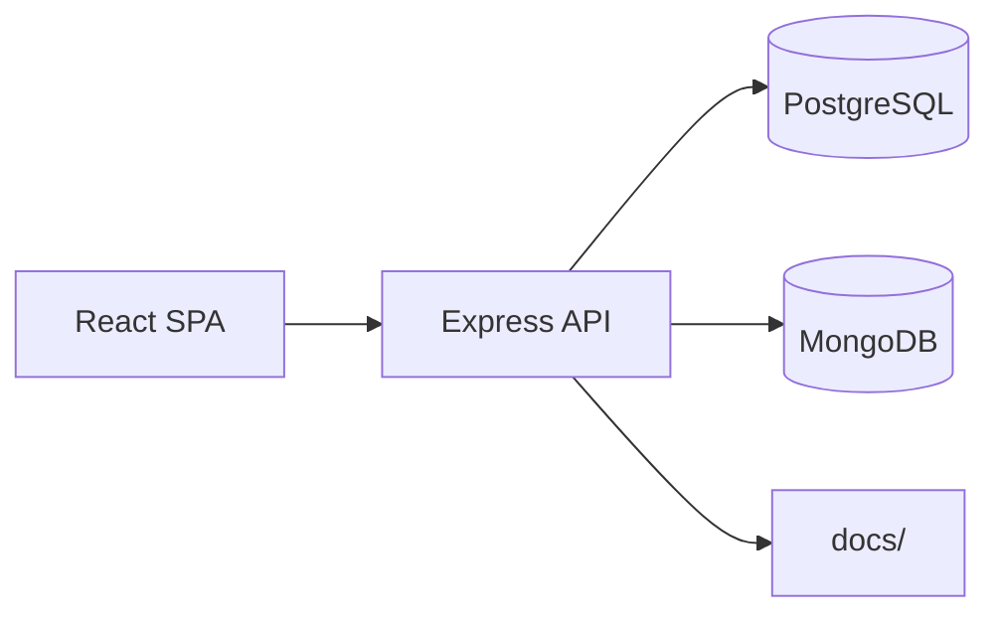

# Project Architecture

## Overview
This system provides a simple full-stack template using Node.js, Express, and React to deliver a single-page application backed by an API. It connects to PostgreSQL for relational data and MongoDB for graph storage and is packaged for containerized deployment.

## High-Level Diagram

<!-- If this diagram doesn’t render, ensure Mermaid support in your Markdown viewer -->

## Technology Stack
| Layer         | Tooling                                        |
|---------------|-----------------------------------------------|
| Frontend      | React, Vite, JavaScript                        |
| Backend       | Express, Node.js                               |
| Database      | PostgreSQL via Sequelize, MongoDB via Mongoose |
| Testing       | Jest, Cypress                                  |
| Containerization | Docker, Docker Compose                       |
| CI/CD         | GitHub Actions                                 |

## Data Flow
- Client sends request
- Authentication processed
- Business logic executed
- Database accessed
- Response returned

## Performance & Scaling
- Use caching and connection pooling where possible
- Apply code-splitting in React for faster loads
- Consider horizontal scaling via Docker clusters

Troubleshoot tip: Verify environment variables in `.env` before running services.
